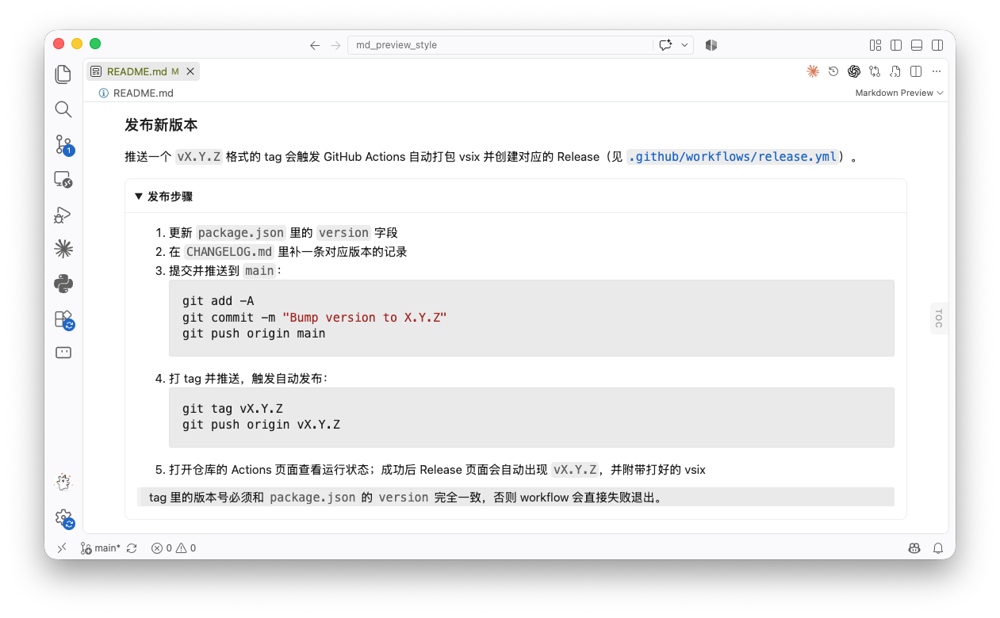

# Markdown Preview Style

一个只有 CSS 的 VS Code 扩展：让 Markdown 预览（`Ctrl/Cmd + Shift + V`）里的折叠块 `<details>` 变成带圆角边框的卡片，而不是浏览器默认的裸三角形，颜色跟随 VS Code 当前主题自动切换浅色 / 深色。

<!-- TODO: 放一张折叠块「展开前 / 展开后」的预览截图，例如 docs/preview.png -->


安装后不需要任何设置，打开任意 Markdown 文件、开启预览即可生效。写法示例：

```html
<details>
<summary>点击展开</summary>

正文内容，支持完整的 Markdown。

</details>
```

## 使用

1. 去 [Releases](https://github.com/minghaoguo20/md_preview_style/releases) 页面下载最新的 `.vsix` 文件
2. 在 VS Code 里打开命令面板（`Ctrl/Cmd + Shift + P`），执行 `Extensions: Install from VSIX...`，选中下载的文件

## 本地构建与发布

### 本地打包安装

用来在改完 `style.css` 后自测，需要 Node.js：

```bash
npx @vscode/vsce package
code --install-extension md-preview-style-*.vsix
```

### 发布新版本

推送一个 `vX.Y.Z` 格式的 tag 会触发 GitHub Actions 自动打包 vsix 并创建对应的 Release（见 [`.github/workflows/release.yml`](./.github/workflows/release.yml)）。

<details>
<summary>发布步骤</summary>

1. 更新 `package.json` 里的 `version` 字段
2. 在 `CHANGELOG.md` 里补一条对应版本的记录
3. 提交并推送到 `main`：
   ```bash
   git add -A
   git commit -m "Bump version to X.Y.Z"
   git push origin main
   ```
4. 打 tag 并推送，触发自动发布：
   ```bash
   git tag vX.Y.Z
   git push origin vX.Y.Z
   ```
5. 打开仓库的 Actions 页面查看运行状态；成功后 Release 页面会自动出现 `vX.Y.Z`，并附带打好的 vsix

> tag 里的版本号必须和 `package.json` 的 `version` 完全一致，否则 workflow 会直接失败退出。

</details>

## License

[MIT](./LICENSE)
